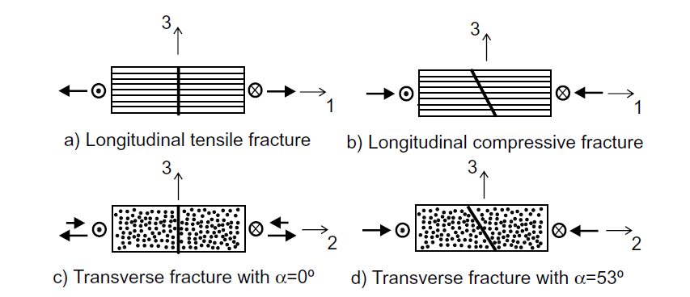
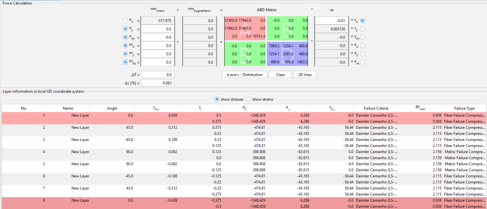
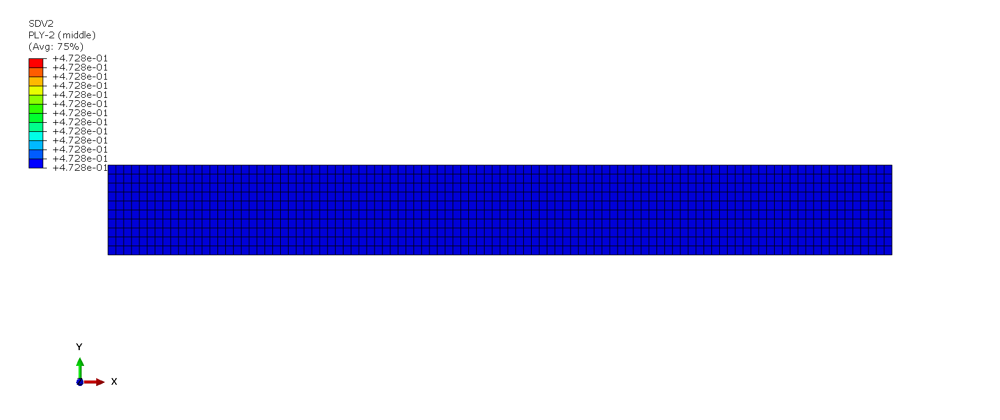

# Daimler-Camanho-2D-Subroutine

<em>Daimler Camanho Failure Modes</em>

The following is a UMAT subroutine for Daimler Camanho failure criteria in Abaqus. It applies only to uni-directional composites. This UMAT considers only in-plane stresses and strains consistent with Classical Laminate Theory.

### Longitudinal Tensile Fracture

$$\phi_{1+} = \frac{\sigma_{11} - \nu_{12}\sigma_{22}}{X_T}$$

### Longitudinal Compression Fracture

$$\phi_{1-} = \frac{\langle |\sigma_{12}^m| + \mu_L\sigma_{22}^m \rangle}{S_L}$$

### Transverse Fracture Perpendicular to the Laminate Mid-plane $(\alpha_0 = 0°)$
$$\phi_{2+} = \sqrt{(1-g)\frac{\sigma_{22}}{Y_T} + g\Big( \frac{\sigma_{22}}{Y_T} \Big)^2 + \Big( \frac{\sigma_{12}}{S_L} \Big)^2 }  \quad (\sigma_{22} \geq 0) $$

$$\phi_{2+} = \frac{\langle |\sigma_{12}| + \mu_L\sigma_{22} \rangle}{S_L}  \quad (\sigma_{22} < 0) $$

### Transverse Fracture $(\alpha_0 = 53°)$

$$\phi_{2-} = \sqrt{\Big( \frac{\tau_T}{S_T} \Big)^2 + \Big( \frac{\tau_L}{S_L} \Big)^2 } \quad (\sigma_{22} < 0) $$

# Input to the Model

The following properties need to be entered in the following order. The superscripts $T$ and $C$ are for tension and compression.
  * Longitudinal Modulus $E_1$
  * Transverse Modulus $E_2$
  * Poisson's Ratio in 1-2 Plane $\nu_{12}$
  * In-plane Shear Modulus $G$
  * Longitudinal Tensile Strength $X_T$
  * Longitudinal Compressive Strength $X_C$
  * Transverse Tensile Strength $Y_T$
  * Transverse Compressive Strength $Y_C$
  * In-plane Shear Strength $S_L$
  * Mode I Fracture Toughness $G_{Ic}$
  * Mode II Fracture Toughness $G_{IIc}$
  
  # Output Visualization
   
  There are five solution-dependent state variables. They are as follows
  * SDV1 : Longitudinal Tensile Fracture
  * SDV2 : Longitudinal Compression Fracture
  * SDV3 : Transverse Fracture $(\alpha_0 = 0°)$ when $\sigma_{22} \geq 0$
  * SDV4 : Transverse Fracture $(\alpha_0 = 0°)$ when $\sigma_{22} < 0$
  * SDV5 : Transverse Fracture $(\alpha_0 = 53°)$
  
  # Verification

<em>FE Model and Boundary Conditions</em>

A simple compressive test is performed to check the working of the UMAT. The specimen dimensions are 100 mm x 10 mm. The ply layup is [0°/+45°/-45°/90°/90°/-45°/+45°/0°], and each ply is 0.125 mm thick. The left end of the specimen is fixed in X, Z, ROTX, ROTY, and ROTZ, and the middle of the left end is fixed in Y. A displacement of -1.0 mm is applied on the right end. The material properties are
* $E_1$ = 135e3 MPa
* $E_2$ = 10e3 MPa
* $\nu_{12}$ = 0.25
* $G$ = 4.3e3 MPa
* $X_T$ = 2410 MPa
* $X_C$ = 1300 MPa
* $Y_T$ = 86 MPa
* $Y_C$ = 200 MPa
* $S_L$ = 152 MPa  
* $G_{Ic}$ = 0.28
* $G_{IIc}$ = 0.79

<em>eLamX² Results</em>

The same model has been created in eLamX²; a composite calculator developed at TU Dresden. Above are the results of the eLamX² calculator. From the above image, It can be seen that the failure occurs in the 0° ply. Now we shall be comparing these with the Abaqus UMAT results.

<em>Ply 1</em>

For the 1st ply, the dominant failure mode is fiber compression (SDV 2), and the failure index is 1.066. The inverse of the failure index is called the Reserve Factor(RF), and its value is 0.938

<em>Ply 2</em>

<em>Ply 3</em>

For the 2nd and 3rd ply, the dominant mode is fiber compression (SDV 2). The failure index is 0.4728, and the reserve factor is 2.115

<em>Ply 4</em>

For the 4th ply, the dominant mode is matrix compression $(\alpha_0 = 53°)$ (SDV 5). The failure index is 0.4631, and the reserve factor is 2.159

The results of the UMAT do match eLamX² results and predict the dominant mode of failure correctly.

# Reference
Maimí, P, Camanho, P. P., Mayugo, J. und Dávila, C. A continuum damage
model for composite laminates: Part I–Constitutive model. Mechanics of materials
39.10, 2007, S. 897–908.
47
